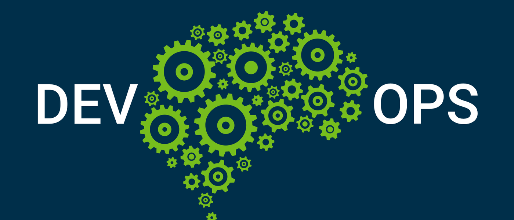

# Bienvenidos al repositorio del equipo 2
## FASE 3 del Bootcamp DevOps Enginner de EducacionIT

### Integrantes:

------------

#### Ávila Rafael
##### :envelope:  rafaelavilahernandez@gmail.com
##### :computer:  Rol laboral: IT Cordinator
##### :mortar_board:  Carrera Bootcamp Devops Engineer
##### Linkedin:  https://www.linkedin.com/in/rafael-avila-6343158b/
------------

#### Bellón Lorena
##### :envelope:  lorena@beckandbell.com
##### :computer:  Rol laboral: Software Engineer
##### :mortar_board: Carrera Bootcamp Devops Engineer
##### Linkedin: https://ar.linkedin.com/in/lorenabellon
------------

#### Lucha Fabian
##### :envelope:  exelucha@gmail.com
##### :computer:  Rol laboral: Recepcionista Hotel Royal Princess
##### :mortar_board: Carrera Bootcamp Devops Engineer
##### Linkedin:  https://www.linkedin.com/in/fabian-ezequiel-lucha-1644bb15b/
------------
#### Luna Diego Martín
##### :envelope:  diegomartinluna@gmail.com
##### :computer:  Rol laboral: Gerente de Sistemas
##### :mortar_board: Carrera Bootcamp Devops Engineer
##### Linkedin:  https://www.linkedin.com/in/diegomartinluna/
------------

#### Quiroga Agustin
##### :envelope:  quirogaagu@gmail.com
##### :computer:  Rol laboral: Analista de infraestructura
##### :mortar_board: Carrera Bootcamp Devops Engineer
##### Linkedin:  https://www.linkedin.com/in/agustin-quiroga-60aab01b1/
------------
#### Trepat Carlos
##### :envelope:  carlostrepat@gmail.com
##### :computer:  Rol laboral: Analista de Systemas
##### :mortar_board: Carrera Bootcamp Devops Engineer
##### Linkedin:  hhttp://linkedin.com/in/ctrepat
------------